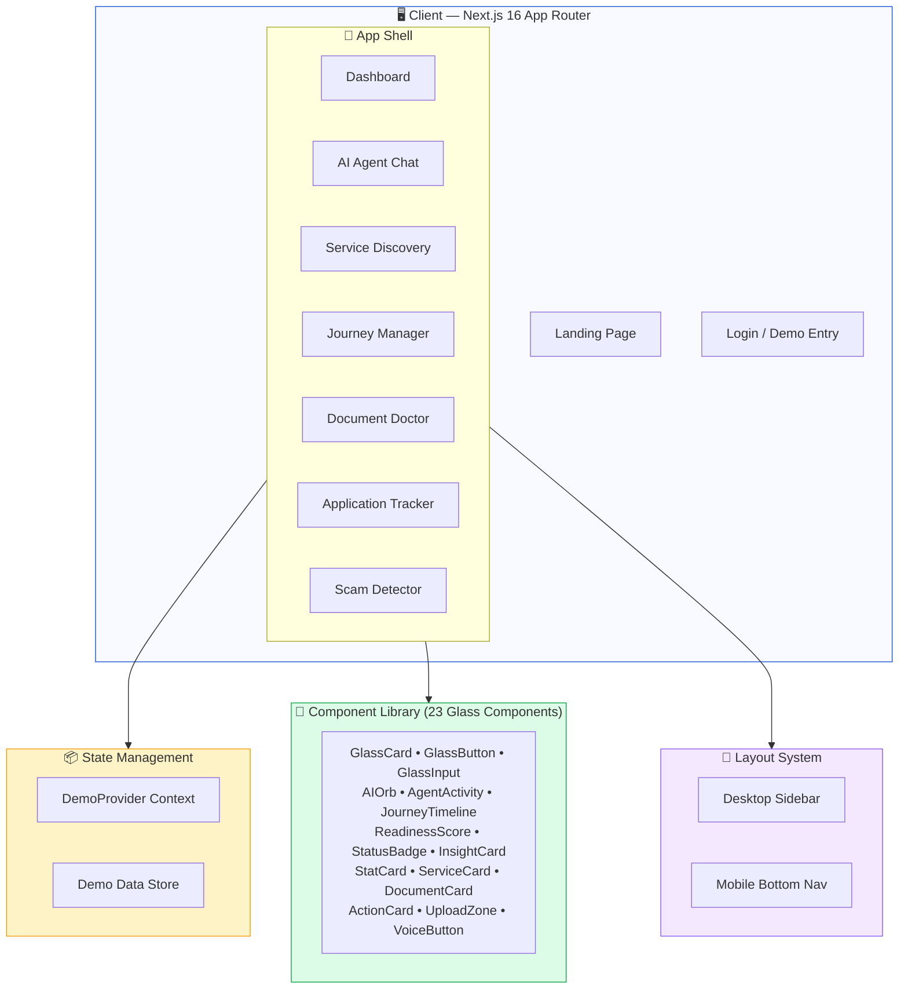
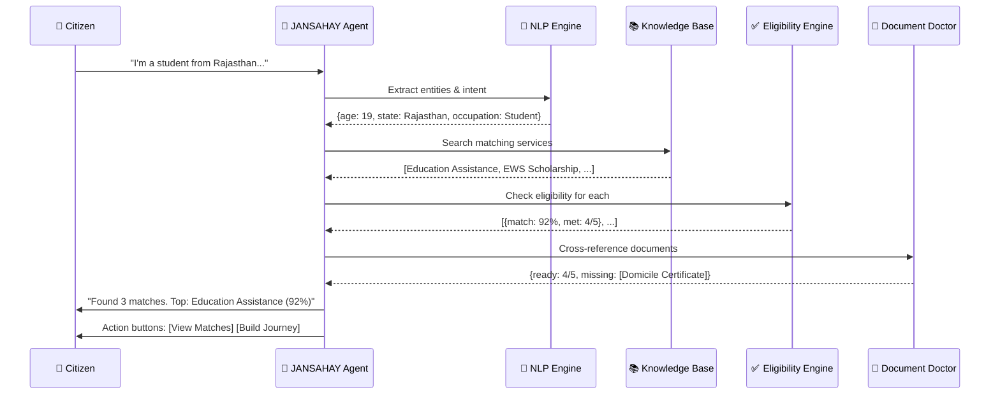
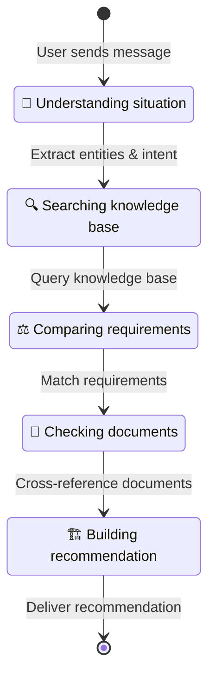

<div align="center">

# 🏛️ JANSAHAY

### AI Public-Service Copilot

**"Tell us your problem. JANSAHAY finds the path."**

[](https://nsut-beryl.vercel.app)
[](https://nextjs.org)
[](https://typescriptlang.org)
[](https://react.dev)
[](https://tailwindcss.com)

<br/>

<p align="center">
  
</p>

<br/>

> **JANSAHAY** is an AI-powered public service copilot that helps Indian citizens discover government schemes, check eligibility, analyze documents, build personalized action plans, track applications, and detect scams — all through a conversational AI interface.

</div>

---

## 📖 Table of Contents

- [The Problem](#-the-problem)
- [Our Solution](#-our-solution)
- [Core Pipeline](#-core-pipeline)
- [Key Features](#-key-features)
- [Architecture](#-architecture)
- [Tech Stack](#-tech-stack)
- [Demo Walkthrough](#-demo-walkthrough)
- [Screenshots](#-screenshots)
- [Getting Started](#-getting-started)
- [Project Structure](#-project-structure)
- [Design System](#-design-system)
- [AI Agent Orchestration](#-ai-agent-orchestration)
- [Trust & Safety](#-trust--safety)
- [Roadmap](#-roadmap)
- [Team](#-team)
- [License](#-license)

---

## 🔴 The Problem

India has **1,300+ government welfare schemes** across central and state governments, yet:

- **60%** of eligible citizens **never apply** due to lack of awareness
- **40%** of applications are **rejected** due to incomplete documentation
- Citizens visit **3-5 offices** on average before finding the right scheme
- **₹2.7 lakh crore** in benefits go **unclaimed** annually
- Vulnerable populations fall prey to **scams** impersonating government services

> There is no single platform that connects a citizen's *problem* to the right *government solution* — end to end.

---

## 💡 Our Solution

**JANSAHAY** acts as an intelligent bridge between citizens and public services:

```
   👤 Citizen's Problem
         │
         ▼
   ┌─────────────┐
   │  JANSAHAY   │──── "Tell us your problem"
   │  AI Copilot  │
   └──────┬──────┘
          │
    ┌─────┼─────┬─────────┬──────────┬──────────┐
    ▼     ▼     ▼         ▼          ▼          ▼
 Understand  Discover  Check     Prepare     Act      Track
 (NLP)     (Match)  (Eligible) (Documents) (Apply) (Monitor)
```

Instead of navigating complex bureaucracy, citizens simply **describe their situation** in natural language, and JANSAHAY:

1. **Understands** their context through conversation
2. **Discovers** matching government schemes
3. **Checks** preliminary eligibility
4. **Prepares** documents with AI analysis
5. **Acts** by building a step-by-step action plan
6. **Tracks** application status

---

## 🔄 Core Pipeline

```mermaid
flowchart LR
    A["👤 Citizen Input<br/><i>'I'm a student from<br/>Rajasthan, need help<br/>with education'</i>"] --> B["🧠 NLP Engine<br/><i>Extract: age, location,<br/>occupation, intent</i>"]
    B --> C["🔍 Service Discovery<br/><i>Match against<br/>scheme database</i>"]
    C --> D["✅ Eligibility Engine<br/><i>Compare requirements<br/>vs citizen profile</i>"]
    D --> E["📄 Document Doctor<br/><i>Analyze uploaded docs,<br/>identify gaps</i>"]
    E --> F["📋 Action Plan<br/><i>Personalized steps<br/>with deadlines</i>"]
    F --> G["📊 Tracker<br/><i>Monitor application<br/>status</i>"]

    style A fill:#e8eeff,stroke:#1a56db,color:#111
    style B fill:#fef3c7,stroke:#f59e0b,color:#111
    style C fill:#e8eeff,stroke:#1a56db,color:#111
    style D fill:#dcfce7,stroke:#16a34a,color:#111
    style E fill:#fce7f3,stroke:#ec4899,color:#111
    style F fill:#e8eeff,stroke:#1a56db,color:#111
    style G fill:#f3e8ff,stroke:#8b5cf6,color:#111
```



---

## ✨ Key Features

### 🤖 Conversational AI Agent
Natural language interface that understands citizen problems in English and Hindi. Real-time activity tracking shows exactly what JANSAHAY is doing at every step.

### 🔍 Smart Service Discovery
Matches citizen profiles against a knowledge base of government schemes using multi-criteria scoring. Shows match percentages and explains *why* each service was recommended.

### ✅ Eligibility Engine
Requirement-by-requirement comparison matrix showing what's met (✓), what's missing (✗), and what needs verification (?). Generates a readiness score.

### 📄 Document Doctor
AI-powered document analysis that extracts fields from uploaded certificates, cross-references with service requirements, and identifies which services each document unlocks.

### 🛡️ Scam Detector
Analyzes suspicious messages for fraud indicators — payment requests, urgency tactics, unofficial channels, impersonation. Checks against official sources.

### 📋 Personalized Journey
End-to-end journey from discovery to application, with a visual timeline, readiness score, and prioritized action items with dependencies.

### 📊 Application Tracker
Monitor submitted applications with status updates, next actions, and timeline visualization.

---

## 🏗️ Architecture

### System Architecture



### AI Agent Pipeline



---

## 🛠️ Tech Stack

| Layer | Technology | Why |
|-------|-----------|-----|
| **Framework** | Next.js 16 (App Router) | Server components, file-based routing, edge-ready |
| **Language** | TypeScript 5.8 | Type safety across the full stack |
| **UI** | React 19 | Latest concurrent features, transitions |
| **Styling** | Tailwind CSS 4.0 | CSS-first config, utility-driven |
| **Animations** | Framer Motion | Declarative animations, gesture support |
| **Icons** | Lucide React | Consistent, tree-shakeable icon set |
| **Fonts** | Inter (Google Fonts) | Modern, legible, variable weight |
| **Deployment** | Vercel | Zero-config, edge network, instant deploys |
| **Design** | Google Stitch | AI-generated prototype as source of truth |

---

## 🎬 Demo Walkthrough

JANSAHAY ships with a complete **Judge Demo Mode** — a deterministic, scripted flow using the persona of **Rohit Sharma** that works without any API keys.

### Demo Persona: Rohit Sharma
| Field | Value |
|-------|-------|
| Age | 19 |
| Location | Jaipur, Rajasthan |
| Occupation | B.Tech CS Student |
| Family Income | ₹2,00,000/year |
| Documents Ready | 4 of 5 |
| Missing Document | Domicile Certificate |

### The 10-Step Demo Flow

```
 1. 🏠 Landing Page       → See product value proposition
 2. 🚀 Click "Explore Demo" → Auto-redirect to dashboard
 3. 📊 Dashboard           → Stats, insights, quick actions
 4. 🤖 AI Agent            → Chat: "I'm a student from Rajasthan..."
 5. 🔍 Discover            → 3 service matches with scores
 6. 📋 Journey             → 6-stage timeline, 78% readiness
 7. 📄 Document Doctor     → Upload → AI extraction → matching
 8. ✅ Action Plan          → Prioritized steps with dependencies
 9. 📊 Tracker             → Application EWS-2026-RJ-00421 under review
10. 🛡️ Verify              → Paste scam message → Risk analysis
```

---

## 📸 Screenshots

<div align="center">

### Landing Page
*Clean hero with AI orb animation and dual CTA*

### Dashboard
*Personalized greeting, stats, insights, quick actions*

### AI Agent
*Split-panel: chat left, agent activity + profile right*

### Document Doctor
*Upload zone + AI extraction + service matching*

### Journey Timeline
*6-stage visual progress with readiness donut*

### Scam Detector
*Message analysis with risk indicators*

</div>

---

## 🚀 Getting Started

### Prerequisites

- **Node.js** ≥ 18.0
- **npm** ≥ 9.0

### Installation

```bash
# Clone the repository
git clone https://github.com/rudraps018/jansahay.git
cd jansahay

# Install dependencies
npm install

# Start development server
npm run dev
```

Open **http://localhost:3000** and click **"Explore Demo"** to experience the full application.

### Build for Production

```bash
npm run build
npm start
```

### Deploy to Vercel

```bash
npx vercel deploy --prod
```

---

## 📁 Project Structure

```
jansahay/
├── src/
│   ├── app/                          # Next.js App Router
│   │   ├── layout.tsx                # Root layout (Inter font, metadata)
│   │   ├── page.tsx                  # Landing page
│   │   ├── login/page.tsx            # Login page
│   │   ├── demo/page.tsx             # Demo redirect
│   │   └── (app)/                    # Authenticated route group
│   │       ├── layout.tsx            # DemoProvider + AppShell wrapper
│   │       ├── dashboard/page.tsx    # Main dashboard
│   │       ├── agent/page.tsx        # AI Agent chat
│   │       ├── discover/
│   │       │   ├── page.tsx          # Service discovery
│   │       │   └── results/page.tsx  # Match results
│   │       ├── services/[id]/page.tsx # Service detail
│   │       ├── eligibility/page.tsx  # Eligibility overview
│   │       ├── journeys/
│   │       │   ├── page.tsx          # Journey list
│   │       │   └── [id]/page.tsx     # Journey detail
│   │       ├── documents/
│   │       │   ├── page.tsx          # Document Doctor
│   │       │   └── [id]/page.tsx     # Document detail
│   │       ├── action-plan/page.tsx  # Action plan
│   │       ├── tracker/page.tsx      # Application tracker
│   │       ├── verify/page.tsx       # Scam detector
│   │       ├── resources/page.tsx    # Knowledge base
│   │       ├── notifications/page.tsx # Notifications
│   │       ├── profile/page.tsx      # User profile
│   │       └── settings/page.tsx     # App settings
│   │
│   ├── components/
│   │   ├── ui/                       # 19 glass UI components
│   │   │   ├── GlassCard.tsx
│   │   │   ├── GlassButton.tsx
│   │   │   ├── GlassInput.tsx
│   │   │   ├── AIOrb.tsx
│   │   │   ├── AgentActivity.tsx
│   │   │   ├── JourneyTimeline.tsx
│   │   │   ├── ReadinessScore.tsx
│   │   │   ├── UploadZone.tsx
│   │   │   ├── VoiceButton.tsx
│   │   │   └── ... (10 more)
│   │   └── layout/                   # Layout components
│   │       ├── Sidebar.tsx
│   │       ├── MobileNav.tsx
│   │       ├── AppShell.tsx
│   │       └── LandingNav.tsx
│   │
│   ├── lib/
│   │   └── demo/
│   │       ├── data.ts               # Complete demo dataset
│   │       └── context.tsx           # React context provider
│   │
│   └── types/
│       └── index.ts                  # TypeScript type definitions
│
├── docs/
│   ├── ARCHITECTURE.md
│   ├── DESIGN_SYSTEM.md
│   └── assets/
│
├── package.json
├── tsconfig.json
├── next.config.ts
└── postcss.config.mjs
```

---

## 🎨 Design System

JANSAHAY uses a **light iOS-inspired glassmorphism** design language:

### Color Palette

| Token | Hex | Usage |
|-------|-----|-------|
| `--color-primary` | `#1a56db` | Buttons, links, active states |
| `--color-primary-light` | `#e8eeff` | Active nav bg, highlights |
| `--color-sidebar` | `#f0f4ff` | Sidebar background |
| `--color-page` | `#f8faff` | Page background |
| `--color-success` | `#16a34a` | Met requirements, completed |
| `--color-warning` | `#f59e0b` | Warnings, needs attention |
| `--color-danger` | `#dc2626` | Urgent actions, scam alerts |

### Glass Effects

```css
.glass-card {
  background: rgba(255, 255, 255, 0.9);
  backdrop-filter: blur(12px);
  border: 1px solid rgba(0, 0, 0, 0.06);
  box-shadow: 0 1px 3px rgba(0, 0, 0, 0.08);
}
```

### Component Variants

- **GlassButton**: `primary` (filled blue) · `secondary` (outline) · `ghost` (text only)
- **StatusBadge**: `success` · `warning` · `danger` · `info` · `neutral`
- **InsightCard**: `action` (red border) · `opportunity` (green) · `update` (blue)
- **AIOrb**: `sm` (input) · `md` (sidebar) · `lg` (agent page)

---

## 🤖 AI Agent Orchestration



The agent processes each query through **5 visible steps**, shown in real-time via the `AgentActivity` component. Each step transitions from `pending` → `active` → `done` with animated indicators.

### Orchestration Tools

| Tool | Input | Output |
|------|-------|--------|
| `extractProfile` | Natural language text | Structured profile (age, location, etc.) |
| `searchServices` | Profile + intent | Ranked service matches |
| `checkEligibility` | Service + profile | Requirement comparison matrix |
| `analyzeDocument` | Uploaded file | Extracted fields + service matches |
| `detectScam` | Suspicious message | Risk score + indicators |

---

## 🛡️ Trust & Safety

JANSAHAY follows strict trust principles:

### ⚠️ Disclaimers
- Every service match is marked as **"Preliminary match — verify current official requirements"**
- Document analysis includes **"Validity requires independent verification"**
- Scam detection shows **"Based on pattern recognition — cannot guarantee accuracy"**

### 🔒 Data Handling
- All demo data is clearly labeled with **"DEMO DATA"** prefixes
- No real government applications are submitted
- Document uploads are processed client-side only
- No PII is stored or transmitted

### 🏷️ Source Attribution
- Every service shows its **source** with verification status
- `TrustIndicator` component marks data as `verified`, `unverified`, or `demo`
- `SourceBadge` shows source name, last verified date, and official URL

---

## 🗺️ Roadmap

### Phase 1 — Demo MVP ✅
- [x] 20 functional routes
- [x] 23 glass UI components
- [x] Complete demo mode
- [x] Scam detection
- [x] Document analysis UI
- [x] Responsive design

### Phase 2 — AI Integration
- [ ] Gemini API for natural language understanding
- [ ] RAG pipeline with government scheme database
- [ ] Real document OCR via Cloud Vision API
- [ ] Hindi language support with translation API

### Phase 3 — Production
- [ ] User authentication (OAuth)
- [ ] PostgreSQL database
- [ ] Real-time application tracking via API integrations
- [ ] Push notifications
- [ ] Offline-first PWA

### Phase 4 — Scale
- [ ] WhatsApp Bot integration
- [ ] Voice-first interface (IVR)
- [ ] Regional language expansion (12+ languages)
- [ ] Government API partnerships

---

## 👥 Team

Built for the hackathon by passionate engineers who believe technology should make government services accessible to every citizen.

---

## 📄 License

This project is licensed under the MIT License — see the [LICENSE](LICENSE) file for details.

---

<div align="center">

**Built with ❤️ for India's citizens**

*JANSAHAY — Because every citizen deserves a path to the services they're entitled to.*

[](https://nsut-beryl.vercel.app)

</div>
